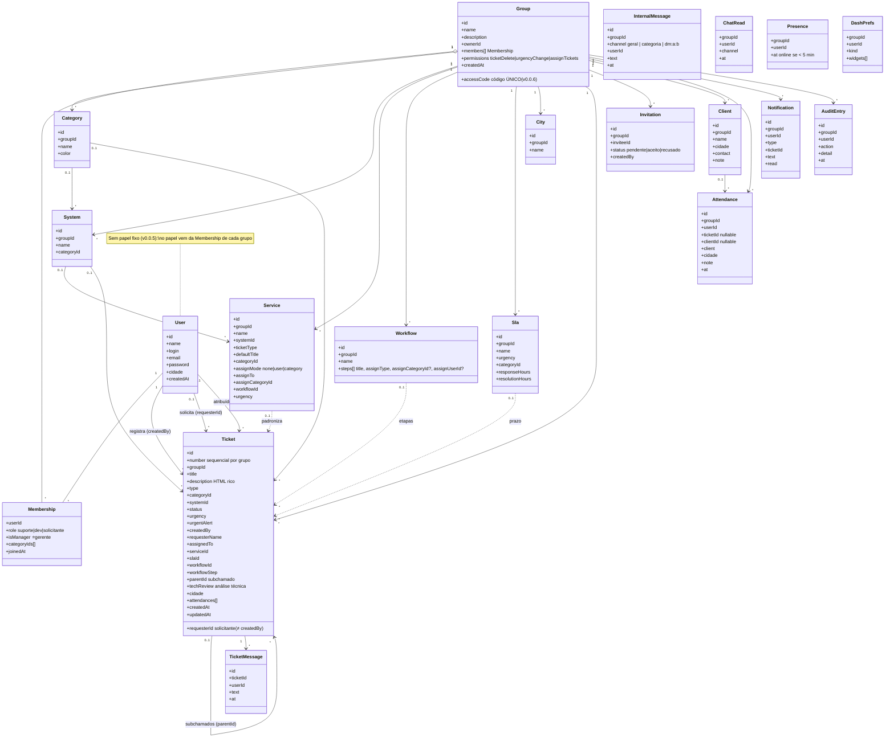
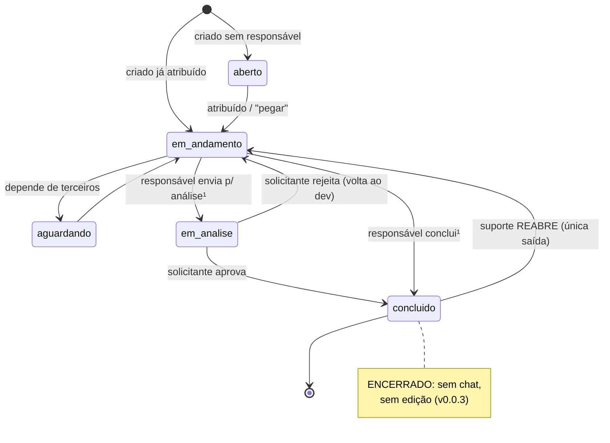
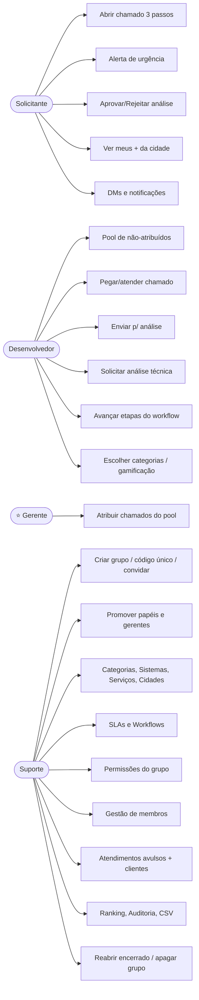

# HelpDesk — Documento de Design (v0.0.5)

Este documento organiza os requisitos funcionais, define os **requisitos não-funcionais**
e apresenta os diagramas UML que orientam a implementação.

> O sistema continua **100% em `localStorage`** (namespace `helpdesk_alpha_v3`, sem backend),
> com toda a persistência isolada em `src/lib/store.js` para permitir a migração futura para
> um banco real sem reescrever o app.
>
> Complementa o [`SISTEMA.md`](SISTEMA.md), que descreve em detalhe tudo o que foi desenvolvido.

---

## 1. Papéis (atores)

Desde a **v0.0.5** o papel **pertence à participação no grupo, não à conta**: o cadastro é
único (nome, login, senha) e cada grupo define se a pessoa é suporte, dev ou solicitante ali
(`membership.role`, resolvido por `roleInGroup()`).

| Papel | Descrição | Como entra no grupo |
|-------|-----------|---------------------|
| **Suporte** | Administra grupos, categorias, sistemas, serviços, cidades, SLAs, workflows, membros, permissões; vê tudo. | Promovido por um técnico do grupo (o criador do grupo já nasce suporte/dono) |
| **Desenvolvedor** | Resolve chamados das suas categorias, pega chamados do "pool", conversa. | Promovido por um técnico do grupo |
| **Solicitante** | Abre chamados e acompanha os seus + os da sua cidade. | **Entrada padrão**: código único do grupo (informando a cidade) ou convite |
| **⭐ Gerente** | *Modificador* de técnico (não é um 4º papel): pode **atribuir chamados**, conforme a permissão do grupo. | Marcado pelo suporte na página Equipe |

---

## 2. Requisitos funcionais (organizados por módulo)

### 2.1 Cadastro & Perfil (RC)
| ID | Requisito | Onde |
|----|-----------|------|
| RC01 | Cadastro e login de usuário | `Auth` |
| RC02 | **Cadastro único sem papel fixo** — o papel é definido por grupo (v0.0.5) | `Auth` + `AuthContext` (`roleInGroup`) |
| RC05 | Cadastro com **código do grupo** → entra como **solicitante** (cidade obrigatória); validação **atômica** (nada é gravado se o código for inválido) | `Auth` (`registerUser`) |
| RC06 | Solicitante informa **cidade** (seleção entre as cidades cadastradas) | `Auth` / `Groups` |
| RC07 | Usuário visualiza o **próprio perfil**, com estatísticas por papel | `Profile` |
| RC08 | **Gamificação** do dev (XP, nível, finalizados/ativos) | `Profile` |
| RC09 | Suporte vê atendimentos por dia e total; solicitante vê taxa de conclusão | `Profile` |

> RC03/RC04 (cadastro livre de técnicos) foram **substituídos** na v0.0.6: todo mundo entra
> como solicitante e os técnicos do grupo promovem depois (ver RP21/RP22).

### 2.2 Grupos, Membros & Permissões (RP)
| ID | Requisito | Onde |
|----|-----------|------|
| RP01 | Técnico cria grupos (quem cria vira o suporte/dono) | `GroupGate` / `Groups` |
| RP02 | Suporte **convida** usuários pelo login/e-mail; convidado **aceita/recusa** e entra como **solicitante** | `Team` + `Invites` |
| RP03/RP08 | Grupos isolam informações (cada grupo é um "organismo"; tudo filtrado por `groupId`) | `store` |
| RP04 | Sem grupo o usuário só vê perfil, convites e grupos | `App` / `GroupGate` |
| RP05 | Técnicos veem os integrantes do grupo (solicitante não) | `Team` |
| RP09 | Grupo tem **Nome + Descrição** | `Groups` / `Team` |
| RP10/RP11 | Usuário participa de vários grupos e **alterna** entre eles | `Groups` + seletor no `Layout` |
| RP12 | Técnico pode **sair** do grupo (dono não; chamados dele voltam ao pool) | `Team` |
| RP13 | Só suporte **apaga** grupo, com **3 avisos encadeados** | `Team` |
| RP14 | Suporte cria **categorias de desenvolvedor** (Web, Desktop…) | `Categories` |
| RP15 | Dev **escolhe** suas categorias; suporte também atribui | `Profile` + `Team` |
| RP16 | **Log de auditoria** de cada movimentação do grupo | `Audit` + `logAudit()` |
| RP17 | Suporte vê todos os tickets, cria filtros, vê os seus | `Tickets` |
| RP18 | Dev vê: atribuídos a si, da sua categoria, sem atribuição | `Tickets` / `Pool` |
| RP19 | Solicitante vê os seus (criados por ele **ou em seu nome**) + os da **sua cidade** | `Tickets` |
| RP20 | O **responsável** conclui o chamado; suporte reatribui | `TicketDetail` |
| RP21 | **Código ÚNICO de acesso** por grupo (v0.0.6): quem entra por ele é sempre **solicitante**; código pode ser **regenerado** (invalida legados) | `Groups` / `Team` |
| RP22 | **Técnicos promovem/rebaixam** membros (solicitante ⇄ dev ⇄ suporte); o dono permanece suporte | `Team` (`setMemberRole`) |
| RP23 | Suporte marca **⭐ gerentes**; gerentes podem **atribuir chamados** (conforme permissão) | `Team` (`setMemberManager`, `canAssignTickets`) |
| RP24 | **Permissões configuráveis** do grupo: exclusão de chamados (bloqueada/suporte), urgência (responsável/suporte), atribuição (suporte+gerentes/só suporte) | `Team` → Configurações (`groupPermissions`) |
| RP25 | **Gestão de membros** pelo suporte: editar perfil/senha, remover do grupo (chamados voltam ao pool) | `Team` (`adminUpdateUser`, `removeMember`) |
| RP26 | **Ações de trabalho no chamado** (status, urgência, atendimentos, chat) restritas ao **técnico responsável** | `domain` (`canEditTicket`, `canChatOnTicket`) |
| RP27 | **Presença**: técnicos **online** (atividade nos últimos 5 min) na aba Visão geral da Equipe | `Team` (`touchPresence`, `isOnline`) |

### 2.3 Chamados & Conteúdo (RCS)
| ID | Requisito | Onde |
|----|-----------|------|
| RCS01 | Criação de chamados em **3 passos**: sistema → serviço → formulário | `NewTicket` |
| RCS02 | Chat interno dos técnicos com **canais** (Geral + um por categoria) | `InternalChat` |
| RCS03 | Chat interno por chamado (solicitante ↔ responsável) | `TicketDetail` |
| RCS04/RCS07 | **Serviços** padronizam a criação (sistema, tipo, título, categoria, urgência, atribuição, workflow); vários por sistema | `Services` + `NewTicket` |
| RCS05 | Solicitante envia **alerta de urgência** 🚨 (força urgência alta) | `TicketDetail` |
| RCS06 | Tickets **sem atribuição** aparecem para todos os técnicos num pool, com contagem ao vivo | `Pool` |
| RCS08 | **Análise do solicitante**: responsável envia p/ análise → solicitante aprova (encerra) ou rejeita (volta ao dev) | `TicketDetail` |
| RCS09 | Ranking de solicitantes (pódio, filtro por cidade; credita ao `requesterId`) | `Ranking` |
| RCS12 | Suporte **registra atendimentos avulsos** (agenda, por técnico, clientes) | `Attendances` |
| RCS13 | **Sistemas do grupo**: identificam o que está com problema, agrupam serviços, vinculam categoria | `Systems` |
| RCS14 | **Descrição rica** (negrito, listas, citação, **imagens** em data URL) | `RichText` |
| RCS15 | Técnico abre chamado **em nome de** um solicitante (cadastrado ou nome livre) — `requesterId` ≠ `createdBy` | `NewTicket` |
| RCS16 | Chamados com **nº sequencial** por grupo + filtros por nº/período/técnico/status/categoria | `Tickets` |
| RCS17 | **Notificações** por usuário (mensagem, status, análise, atribuição, urgência) com badges na sidebar | `Notifications` |
| RCS18 | Chamado concluído fica **encerrado** (sem chat/edição); só o **suporte reabre** | `TicketDetail` (`reopenTicket`) |
| RCS19 | **Conversas individuais (DM)** entre membros; solicitante vê **só** DMs | `InternalChat` (`dm:` channels) |
| RCS20 | **Cadastro de clientes** (nome, cidade, contato) usado no registro de atendimentos | `Attendances` → Clientes |
| RCS21 | **Painel personalizável** por usuário: widgets por papel (KPIs, série temporal, status, urgência, sistemas, cidades, tempo de resolução, análises pendentes, carga da equipe, SLA, atendimentos) | `Dashboard` (`prefs`) |
| RCS22 | **Relatórios CSV** em todos os cadastros e listagens | `lib/report.js` |
| RCS23 | **Atribuição automática** pelo serviço: nenhuma / técnico fixo / **balanceada por categoria** (dev com menos chamados ativos) | `domain` (`pickDevForCategory`) |
| RCS24 | **Atendimento automático** registrado na criação do chamado | `NewTicket` |

### 2.4 Processos & Prazos (RPR) — v0.0.5
| ID | Requisito | Onde |
|----|-----------|------|
| RPR01 | **Cadastro de cidades** do grupo — campos "cidade" viram seleção | `Cities` |
| RPR02 | **SLA configurável**: prazos de 1ª resposta e solução por urgência (e opcionalmente categoria) | `Slas` |
| RPR03 | **Acompanhamento de SLA** no chamado e no painel (ok / perto de vencer / estourado / cumprido / violado); melhor SLA escolhido por categoria+urgência > urgência > genérico | `TicketDetail` / `Dashboard` (`slaInfo`) |
| RPR04 | **Workflows**: fluxos com etapas nomeadas e atribuição por etapa (suporte balanceado / categoria / técnico fixo / responsável do pai) | `Workflows` |
| RPR05 | Etapas geram **subchamados encadeados** (`parentId`); o **pai não conclui** (nem vai p/ análise) com subchamados abertos; conclusão da etapa avisa o responsável do pai | `TicketDetail` (`advanceWorkflow`) |
| RPR06 | **Subchamado manual** a partir de qualquer chamado | `TicketDetail` (`createSubticket`) |
| RPR07 | **Análise técnica** dev → suporte: dev encaminha dúvida ao suporte, que responde no chamado | `TicketDetail` (`requestTechReview` / `respondTechReview`) |

---

## 3. Requisitos não-funcionais (RNF)

| ID | Requisito | Como é atendido |
|----|-----------|-----------------|
| RNF01 | **Persistência isolada** — toda leitura/escrita passa por `store.js` | Camada única `db.*` (19 coleções); migração futura só reimplementa esse arquivo |
| RNF02 | **Isolamento de dados por grupo** (multi-tenant lógico) | Toda consulta filtra por `groupId`; nada vaza entre grupos |
| RNF03 | **Autorização por papel** centralizada | Objeto `can` + helpers (`canEditTicket`, `canAssignTickets`…) em `domain.js`; UI e regras usam a mesma fonte |
| RNF04 | **Auditoria** de ações sensíveis | `logAudit()` chamado em todas as mutações do grupo |
| RNF05 | **Usabilidade** — feedback claro, confirmações em ações destrutivas | Modais de confirmação informando o que será afetado; 3 avisos p/ apagar grupo |
| RNF06 | **Responsividade** | Sidebar → drawer ≤860px; grades empilham ≤820px; ajustes finos até 480px; modo "rail" |
| RNF07 | **Portabilidade** — roda só com `npm install && npm run dev` | Vite + React 19, **zero dependências** de UI/gráficos/editor |
| RNF08 | **Manutenibilidade** — domínio separado da UI | `lib/` (regras) × `pages/` (telas) × `components/` (UI) |
| RNF09 | **Integridade referencial** amenizada | Remoções tratam órfãos (categoria/sistema/cliente removidos → referências anuladas; membro removido → chamados voltam ao pool) |
| RNF10 | **Segurança (alpha)** — senha em texto plano é aceitável só no protótipo | Comentado no código; hash fica para o backend real |
| RNF11 | **Reatividade simples** — `localStorage` não é reativo | `AuthContext` expõe `tick`/`refresh()`; mutação → `refresh()` relê os dados |
| RNF12 | **Tema claro/escuro** (design "Aero", v0.0.4) | `lib/theme.js`; preferência persistida |
| RNF13 | **Exportabilidade** — dados saem do sistema | Relatórios **CSV** em todos os cadastros (`lib/report.js`) |

---

## 4. Diagramas UML

### 4.1 Diagrama de classes (modelo de dados)

### 4.2 Estados do ticket (RCS08 + RCS18 — análise e encerramento)

> ¹ Bloqueado enquanto houver **subchamados abertos** (RPR05) — as etapas do workflow
> precisam ser concluídas antes de finalizar ou enviar o pai para análise.

### 4.3 Casos de uso (visão por papel)

---

## 5. Matriz de permissões (resumo — RNF03)

| Ação | Suporte | Dev | Solicitante |
|------|:------:|:---:|:-----------:|
| Criar grupo / entrar por código | ✅ | ✅ | entra pelo código no cadastro |
| Convidar / apagar grupo / regenerar código | ✅ | ❌ | ❌ |
| Promover/rebaixar papel de membro | ✅ | ✅ | ❌ |
| Marcar ⭐ gerente / editar membro / remover membro | ✅ | ❌ | ❌ |
| Configurar permissões do grupo | ✅ | ❌ | ❌ |
| Sair do grupo | ✅ (exceto dono) | ✅ | ❌ |
| Ver membros do grupo | ✅ | ✅ | ❌ |
| Criar categorias / sistemas / cidades / SLAs / workflows | ✅ | ❌ | ❌ |
| Escolher as próprias categorias | — | ✅ | — |
| Criar serviços (modelos) | ✅ | ✅ | ❌ |
| Criar chamado | ✅ | ✅ | ✅ |
| Criar chamado **em nome de** um solicitante | ✅ | ✅ | — |
| Atribuir chamado a alguém | ✅ | pegar p/ si (⭐gerente atribui²) | ❌ |
| Status / urgência³ / atendimentos no chamado | só o **responsável** | só o **responsável** | ❌ |
| Chat do chamado | responsável | responsável | ✅ (autor) |
| Enviar p/ análise do solicitante | ✅ (responsável) | ✅ (responsável) | ❌ |
| Aprovar/rejeitar análise | ❌ | ❌ | ✅ (autor) |
| Alerta de urgência | ❌ | ❌ | ✅ (autor) |
| Solicitar análise técnica | — | ✅ | ❌ |
| Responder análise técnica | ✅ (designado) | ❌ | ❌ |
| Reabrir chamado encerrado | ✅ | ❌ | ❌ |
| Excluir chamado | conforme permissão⁴ | ❌ | ❌ |
| Registrar atendimento avulso / clientes | ✅ | ❌ | ❌ |
| Ranking / auditoria | ✅ | ❌ | ❌ |
| Chat interno (canais) | todos os canais | Geral + suas categorias | só DMs |
| Exportar CSV | ✅ | nas telas que acessa | ❌ |

> ² Conforme a permissão `assignTickets` do grupo (`suporte+gerentes` ou `somente suporte`).
> ³ Conforme a permissão `urgencyChange` (`responsável` ou `somente suporte`).
> ⁴ Exclusão **bloqueada por padrão**; o grupo pode liberá-la ao suporte (`ticketDelete`).
> Bloqueada também se houver subchamados abertos.

---

## 6. Rastreabilidade das versões

| Versão | Principais adições (requisitos) |
|--------|--------------------------------|
| v0.0.1–v0.0.2 | Base: RC01–RC07, RP01–RP20, RCS01–RCS12 |
| v0.0.3 | RCS13 (3 passos), RCS17 (notificações), RCS18 (encerramento), RCS20 (clientes), RCS23 (atribuição balanceada) |
| v0.0.4 | Redesign "Aero" (RNF12 — tema claro/escuro), sem mudanças de lógica |
| v0.0.5 | RC02 (cadastro único), RP23–RP25 (gerentes, permissões, gestão de membros), RCS16 (nº sequencial), RCS19 (DMs), RCS21 (painel personalizável), RCS22 (CSV), RCS24, RPR01–RPR07 (cidades, SLA, workflows, análise técnica) |
| v0.0.6 | RP21–RP22 (código único + promoção de papéis), RP27 (presença online), aba Visão geral da Equipe, novos widgets do painel |

O histórico narrativo completo está no [`SISTEMA.md`](SISTEMA.md#9-histórico-da-evolução).
