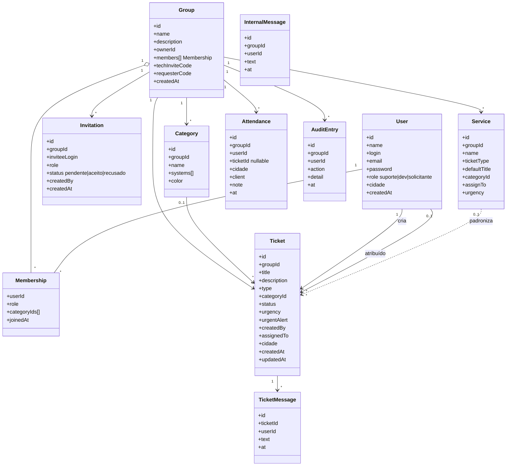
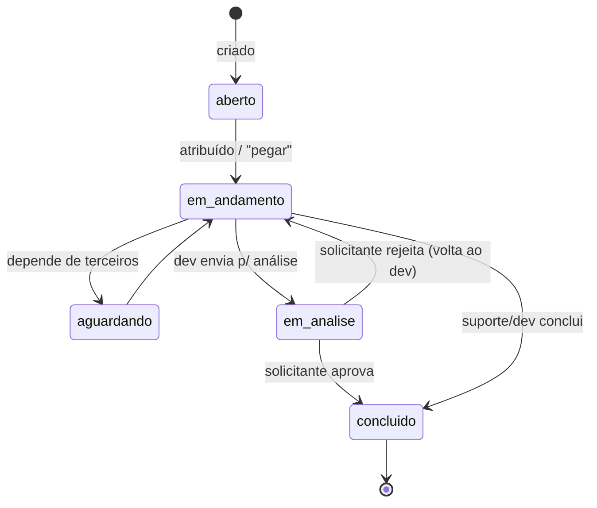
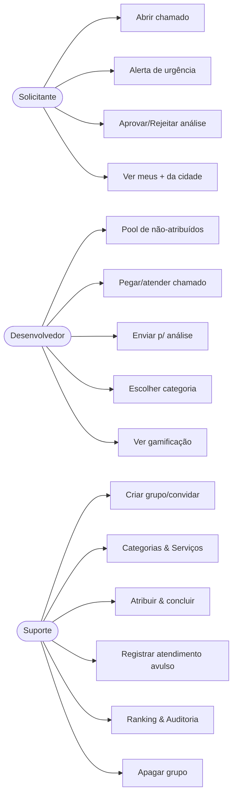

# HelpDesk — Documento de Design (v02)

Este documento organiza os requisitos funcionais, define os **requisitos não-funcionais**
e apresenta os diagramas UML que orientam a implementação da versão 02.

> A v02 continua **100% em `localStorage`** (sem backend), com toda a persistência isolada
> em `src/lib/store.js` para permitir a migração futura para um banco real sem reescrever o app.

---

## 1. Papéis (atores)

| Papel | Descrição | Cadastro |
|-------|-----------|----------|
| **Suporte** | Administra grupos, categorias, serviços, convites, atribuições; vê tudo. | Livre |
| **Desenvolvedor** | Resolve chamados das suas categorias, pega chamados do "pool", conversa. | Livre |
| **Solicitante** | Abre chamados e acompanha os seus + os da sua cidade. | **Só com código do suporte** |

---

## 2. Requisitos funcionais (organizados por módulo)

### 2.1 Cadastro & Perfil (RC)
| ID | Requisito | Onde |
|----|-----------|------|
| RC01 | Cadastro e login de usuário | `Auth` |
| RC02 | 3 tipos de conta: suporte, dev, solicitante | `Auth` |
| RC03/RC04 | Suporte e dev se cadastram normalmente | `Auth` |
| RC05 | Solicitante só se cadastra com **código do suporte** | `Auth` (valida código) |
| RC06 | Solicitante informa **cidade** no cadastro | `Auth` |
| RC07 | Usuário visualiza o **próprio perfil** | `Profile` |

### 2.2 Grupos & Permissões (RP)
| ID | Requisito | Onde |
|----|-----------|------|
| RP01 | Suporte cria grupos | `GroupGate` / `Team` |
| RP02 | Suporte **convida** usuários para o grupo | `Team` (convites) |
| RP03/RP08 | Grupos isolam informações (cada grupo é um "organismo") | `store` (tudo filtrado por `groupId`) |
| RP04 | Sem grupo o usuário só vê perfil/configurações | `App` / `GroupGate` |
| RP05 | Todos, **exceto solicitante**, veem os integrantes do grupo | `Team` (leitura liberada) |
| RP06 | Dev **aceita/recusa** convites | `Invites` |
| RP07 | Técnicos (suporte/dev) podem criar/editar/excluir | Regras em `domain` |
| RP09 | Grupo tem apenas **Nome + Descrição** | `GroupGate` / `Team` |
| RP10 | Suporte e dev participam de vários grupos | `AuthContext` (multi-grupo) |
| RP11 | Usuário alterna entre grupos | `Layout` (seletor) |
| RP12 | Usuário (exceto solicitante) pode **sair** do grupo | `Team` |
| RP13 | Só suporte **apaga** grupo, com avisos | `Team` (confirmação dupla) |
| RP14 | Suporte cria **categorias de desenvolvedor** (web, desktop…) | `Categories` |
| RP15 | Dev **escolhe** sua categoria; suporte também atribui | `Profile` (dev) + `Team` |
| RP16 | **Log de auditoria** de cada movimentação do grupo | `Audit` + `logAudit()` |
| RP17 | Suporte vê todos os tickets, cria filtros, vê os seus | `Tickets` |
| RP18 | Dev vê: atribuídos a si, da sua categoria, sem atribuição | `Tickets` / `Pool` |
| RP19 | Solicitante vê os seus + todos os da **sua cidade** | `Tickets` |
| RP20 | Suporte e dev marcam tickets como concluído | `TicketDetail` |

### 2.3 Conteúdo do sistema (RCS)
| ID | Requisito | Onde |
|----|-----------|------|
| RCS01 | Criação de tickets | `NewTicket` |
| RCS02 | Chat geral entre técnicos | `InternalChat` |
| RCS03 | Chat interno por ticket | `TicketDetail` |
| RCS04/RCS07 | **Serviços**: padronizam a criação de tickets (título, categoria, atribuição, urgência); vários por assunto | `Services` + `NewTicket` |
| RCS05 | Solicitante envia **alerta de urgência** no ticket | `TicketDetail` |
| RCS06 | Tickets **sem atribuição** aparecem para todos os devs num dashboard | `Pool` |
| RCS08 | Marcar ticket para **Análise** → solicitante aprova ou **rejeita** (volta ao dev) | `TicketDetail` (máquina de estados) |
| RCS09 | Ranking de quem mais abre solicitações, com filtro por cidade | `Ranking` |
| RCS10 | **Gamificação** do dev (tickets finalizados/atribuídos, XP) | `Profile` |
| RCS11 | Perfil do suporte mostra atendimentos por dia e total | `Profile` |
| RCS12 | Página para o suporte **registrar atendimentos avulsos** (ex.: atendeu cliente em Itajubá) | `Attendances` |

---

## 3. Requisitos não-funcionais (RNF) — definidos para a v02

| ID | Requisito | Como é atendido |
|----|-----------|-----------------|
| RNF01 | **Persistência isolada** — toda leitura/escrita passa por `store.js` | Camada única `db.*`; migração futura só reimplementa esse arquivo |
| RNF02 | **Isolamento de dados por grupo** (multi-tenant lógico) | Toda consulta filtra por `groupId`; nada vaza entre grupos |
| RNF03 | **Autorização por papel** centralizada | Objeto `can` em `domain.js`; UI e regras usam a mesma fonte |
| RNF04 | **Auditoria** de ações sensíveis | `logAudit()` chamado nas mutações de grupo |
| RNF05 | **Usabilidade** — feedback claro, confirmações em ações destrutivas | Modais/`confirm` com avisos progressivos (RP13) |
| RNF06 | **Responsividade** básica | Layout flex/grid, sidebar fixa |
| RNF07 | **Portabilidade** — roda só com `npm install && npm run dev` | Vite + React, sem serviços externos |
| RNF08 | **Manutenibilidade** — domínio separado da UI | `lib/` (regras) × `pages/` (telas) × `components/` (UI) |
| RNF09 | **Integridade referencial** amenizada | Remoções tratam órfãos (ex.: categoria removida → ticket sem categoria) |
| RNF10 | **Segurança (alpha)** — senha em texto plano é aceitável só no protótipo | Comentado no código; hash fica para o backend real |

---

## 4. Diagramas UML

### 4.1 Diagrama de classes (modelo de dados)

### 4.2 Estados do ticket (RCS08 — fluxo de análise)

### 4.3 Casos de uso (visão por papel)

---

## 5. Matriz de permissões (resumo — RNF03)

| Ação | Suporte | Dev | Solicitante |
|------|:------:|:---:|:-----------:|
| Criar grupo | ✅ | ✅¹ | ❌ |
| Convidar / apagar grupo | ✅ | ❌ | ❌ |
| Sair do grupo | ✅ | ✅ | ❌ |
| Criar categorias | ✅ | ❌ | ❌ |
| Escolher a própria categoria | — | ✅ | — |
| Criar serviços | ✅ | ✅ | ❌ |
| Criar ticket | ✅ | ✅ | ✅ |
| Atribuir ticket | ✅ | pegar p/ si | ❌ |
| Concluir ticket | ✅ | ✅ | ❌ |
| Enviar p/ análise | ✅ | ✅ | ❌ |
| Aprovar/rejeitar análise | ❌ | ❌ | ✅ (autor) |
| Alerta de urgência | ❌ | ❌ | ✅ (autor) |
| Registrar atendimento avulso | ✅ | ✅ | ❌ |
| Ver ranking / auditoria | ✅ | ❌ | ❌ |

> ¹ Qualquer técnico pode iniciar um grupo próprio; ao criá-lo torna-se o suporte/dono dele.
